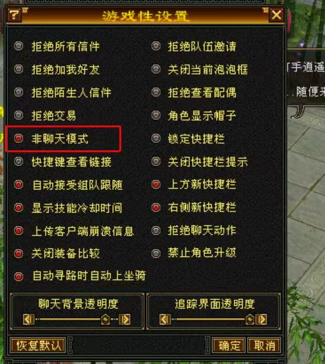
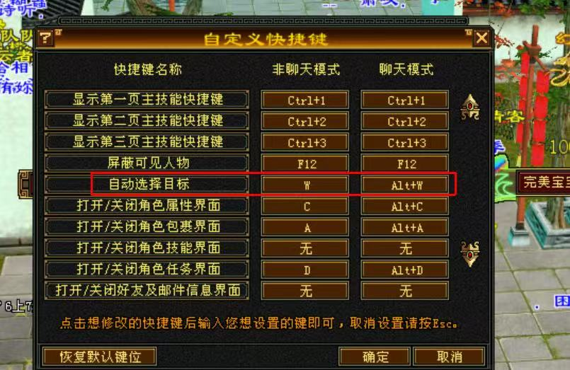

# 基础使用

本章节介绍无极助手的基本使用方法。

## 基础配置

使用软件前，请先完成以下基础配置：

### 游戏设置

1. **游戏设置非聊模式**
   - `esc`进入系统选项 -> 游戏性设置 -> 勾选非聊天模式 -> 确定

   

2. **自定义快捷键-自动选择目标**
   - `esc`进入系统选项  -> 自定义快捷键 -> 自动选择目标, 设置为F2，熟悉软件后可灵活调节

   
3. **检查游戏快捷键F1是否为门派普通攻击**
   - 例如：星宿的普通攻击为蓝砂手

### 脚本设置

1. 预设配置选中打死换怪-仅平推，点击使用。
2. 绑定游戏窗口， 绑定步骤见下

**方式一：**（推荐）
1. 长按主界面的红色"准星图标"不松开
2. 将图标拖动到游戏窗口上
3. 松开鼠标
4. 软件会自动识别并绑定
5. 状态栏显示"已绑定窗口：《天龙八部》 xxx"表示成功

**方式二：**
1. 主界面存在一键绑定按钮，直接点击即可绑定
2. 注意，这种方式适合只有一个游戏窗口的情况，实现快速绑定。

**至此，设置完成，可以走到怪物附近，运行软件就可以进行最基础的打死换怪了。**

<!-- ### 配置预设

软件默认提供三个预设：

- **我是峨眉**：绑定的窗口是峨眉角色，会执行峨眉的加血逻辑
- **打死换怪-仅平推**：打死怪物后自动换怪，只平推，不释放技能
- **抢怪模式-仅平推**：扫射模式，只平推，不释放技能

可以根据自己的需求自定义预设。 -->
